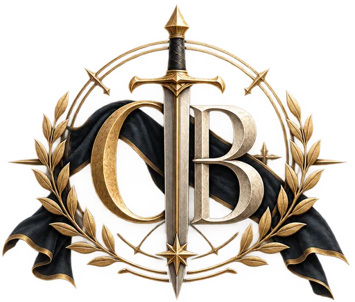

# Order of Battle

Unofficial Age of Sigmar army builder and table companion.

**Free. No account. Lists stay on your device.** Made for the hobby community — not a commercial product, and not affiliated with Games Workshop.

<p align="center">
  
</p>

## What it does

- **Build** — regiments, reinforcements, formations, spell/prayer lores, Regiments of Renown
- **Play** — wounds, lasting magic/prayer notes, abilities by phase
- **Local-only** — saved in the browser (IndexedDB); nothing uploaded to our servers

Catalogue data comes from the community [BSData](https://github.com/BSData) Age of Sigmar 4th edition project. Always confirm points and rules with official Games Workshop materials and your opponent or TO before you play.

## Quick start

```bash
yarn install
yarn dev
```

Open [http://localhost:3000](http://localhost:3000).

```bash
yarn lint
yarn build
```

## Stack

- Next.js (App Router) + React + TypeScript
- Tailwind CSS
- Pure domain logic under `src/engine/`
- UI under `src/components/`; thin routes under `src/app/`

## Legal

- Privacy policy at `/privacy`
- Terms of use at `/terms`
- Code license: [MIT](./LICENSE) (with trademark notice)

Warhammer, Age of Sigmar, and related marks are property of Games Workshop. This is fan work. The “JW / James Workshop” line in the footer is a joke, not affiliation.

If you are a rights holder and want artwork removed, contact [contact@zheat.xyz](mailto:contact@zheat.xyz).

## Contact

[contact@zheat.xyz](mailto:contact@zheat.xyz)
